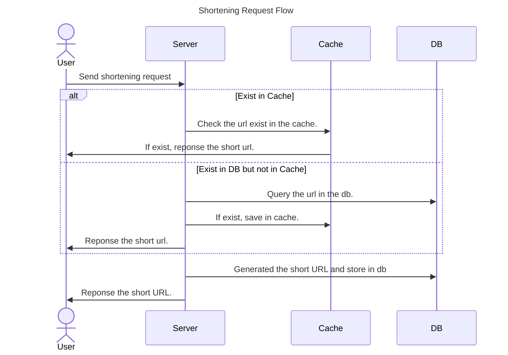
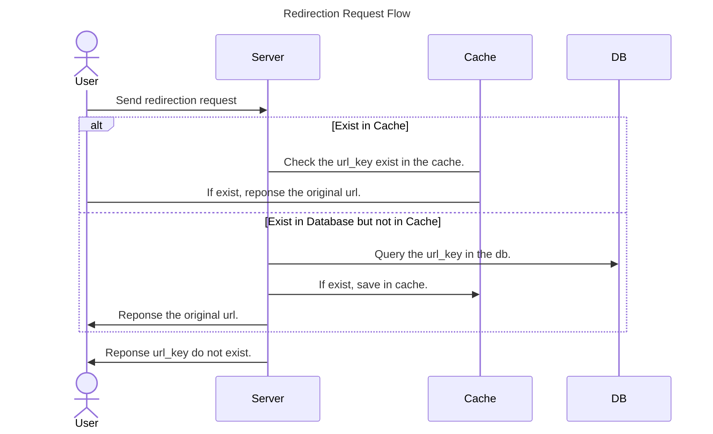

# TinyURL

**Purpose**: 建立一個服務，可以讓過長的網址變成短的網址。透過這個來練習System Design。

# Functional Requirements

## Phase 1
1. 能夠把長的網址變成短網址
2. 能夠把短網址轉成長網址
3. 短網址過期時間

## Phase 2
1. 自訂短網址
2. 刪除短網址
3. 更新短網址

# Non-functional Requirements

1. Availability: 此服務需要無時無刻在線上，如果斷線將無法成功將短網址導向正確的網址。設計必須可以容錯。
2. Scalability: 此服務應該可以水平擴展，當流量大的時候會需要用到
3. Latency: 此服務需要低延遲來提供絲滑的體驗。
4. Unpredictability: 為了安全為由，我們產出的短網址需要不可預測的，避免有人猜出我們已經產生過的URL。

# Resource Estimation

先要有大目標或假設，才能進行估算。

1. 預估 shortening vs redirection 比例應該 1:100
2. 會有 一個月會有 200 Million 的 shortening 請求
3. 一個短網址需要500 Bytes的空間
4. 每個短網址只活 5 年，超過就刪掉
5. 有1億的 Daily Active User (DAU)

## Storage Estimation

每個月會有 200 million ，一年就有 2.4 billion，資料會存活5年，會有12 billion 的短網址資料

一筆資料 500 bytes 這樣就會需要 6TB的空間！

## Query rate estimation

拿上述資料 每個月會有200 million 筆 shortening，那依照比例乘以100 就會有 20 billion 筆 redirection 的request

平均一個月是30.42天，則可以得到 Queries per second (QPS)

30.42 day * 24 hours * 60 minutes * 60 seconds = 2628288 seconds

20 billion / 2628288 seconds = 7.6 K URL/s

## Bandwidth estimation

**Write request (Shortening)**: 每秒會有 76 個新的短網址

76 * 500 Bytes * 8 Bits = 304 Kbps

**Read Request (redirections)**: 每秒 7600 次

7600 * 500 Bytes * 8 Bits = 30.4 Mbps

加起來共 30.7 Mbps

## Memory estimation

根據 80-20 法則，把Read的QPS * 資料預估大小 在抓20%

7.6K * 3600 * 24 hours = 0.66 billion / per day

0.2 * 0.66 billion * 500 Bytes = 66GB

## Number of servers estimation

TBD…

## Summarizing estimation

| Type of operation | Time estimation|
| - | - |
| New URL | 76/s|
| URL redirection | 7600/s |
| Incoming data | 304Kpbs |
| Outgoing data | 30.4Mbps |
| Storage for 5 year | 6 TB |
| Memorary for cache | 66GB |
| Servers | *TBD* |

# API

## Shortening

- **Request**
    
    Method: Post , Content Type: Json
    
    | Parameter | Description |
    | --- | --- |
    | url | The original URL that is need to shortened. |
- **Response**
    
    Content Type: Json
    
    | Parameter | Description |
    | --- | --- |
    | url_key | The shortened URL. |
- **Request Flow**

- **Question**
    1. 假設對短網址在做一次短網址應該要怎麼處理？
    **Answer**: 在TinyURL.com的做法是，他會回應 ‘URL domain banned.’，猜測他會先檢查網址的domain是不是自己本身。

## Redirection

- **Request**
    
    Method: Get 
    
    | Parameter | Description |
    | --- | --- |
    | url_key | The shortened URL. |
- **Response**
    
    Content Type: Json
    
    | Parameter | Description |
    | --- | --- |
    | url | The original URL. |
- **Request Flow**
    

# Encoder Detail

以下是對短網址的需求:
1. 只能包含英數字。
2. 不要有看起來很像的字 `0, O, I, and l.`，確保易讀性。
3. 最短要有六個字元。

當前最常使用的編碼方式是Base58，但會有非英數字且會有看起來很像的字。故採用拿除`0, O, I, and l.`這些字元的Base58(Bitcoin)。

那要如何決定編碼的種子為何？如果拿整串網址來做編碼，會顯得短網址變很長？ex: `https://www.google.com` - Base58 -> `VMK7D8tQvwsSRPLJpqFshq2PoWYTQg`。這樣會讓整串沒有易讀性，故不能選擇這種方式。
假設有一個序列計數器可以產生以10為基數得64位元整數，在每次要產生短網址時去跟他要當前計數，用此串數字來編碼產生短網址，這樣既能確保易讀性又可以讓人不知道原本的長網址。為了我們短網址的要求，最短要有六個字元，故計數器的初始計數不能太小至少要有10位數(1,000,000,000)。初始位置有了那結束位置需要知道才能知道可以用幾個。
我們可以透過以下兩點知道基數的總數有多少
1. log2n 表示 n 基數中一位數字的位數。
2. 總位數就會是 (總位元數 / 一個數字的位數)。

下面為在64bit底下的範例：

| Base number | 一個數字的位元 | 總數 |
| - | - | - |
| 10 | log210 = 3.13 | 64/3.13 = 20 |
| 58 | log258 = 5.85 | 64/5.85 = 11 |

所以我們序列產生器能夠產出最大的長度為20，最大值為264-1(18,446,744,073,709,551,615)。短網址的長度最大長度為11，值為jpXCZedGfVQ。
現在我們有了起始數字與結束數字和上方預估的流量就能算出這樣的總數夠不夠用。
- 能夠用的數字是 264 - 109
- 一個月會有200 million 的shortening 的請求，一年就會有 2.4 billion個。

所以拿能用的數字除以一年的請求數就能得知可以用幾年。 
(264 - 109) / 2.4 billion = 7,686,143,363.63 年

由此可知，用不完。

但如果我們存在 Postgres 裡，以bigserial的型態儲存 最長就只有 264-1，在算算這樣能用多久。
(264-1 - 109) / 2.4 billion = 3,843,071,681.6 年

OK，也是非常夠用。

# REF
[Educative - System Design TinyURL](https://www.educative.io/courses/grokking-modern-system-design-interview-for-engineers-managers/system-design-tinyurl)

[Golang Strandard Project Layout](https://github.com/golang-standards/project-layout)

[Base58 Encode/Decode Online](https://www.dcode.fr/base-58-cipher)

[Educative - Design of a Unique ID Generator](https://www.educative.io/courses/grokking-modern-system-design-interview-for-engineers-managers/design-of-a-unique-id-generator)

[Golang-migrate](https://github.com/golang-migrate/migrate)